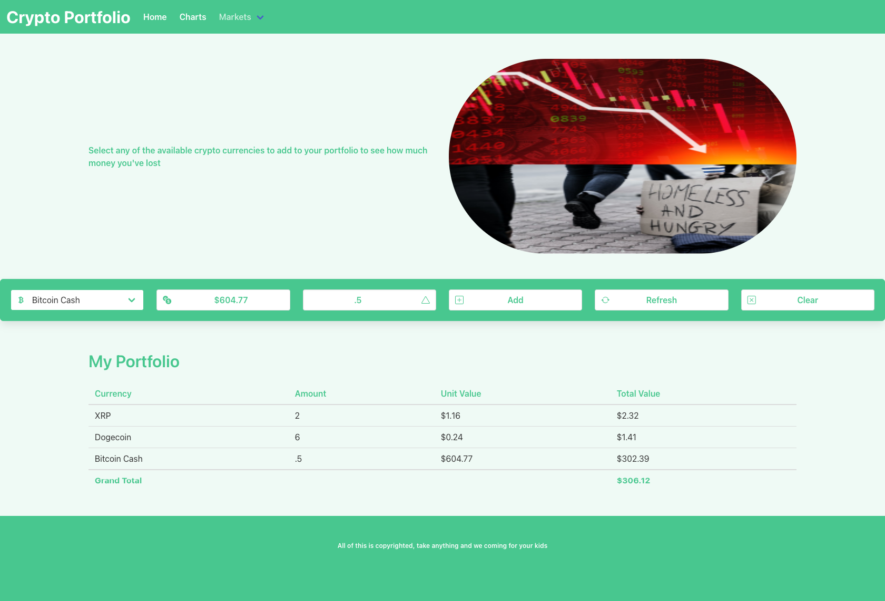

# Project 1 - Cryptocurrency Tracker
## Group 4 - Nicole, Michael, Moe & Pamela
An application designed for a user to save and keep track of their personal cryptocurreny portfolio.

## User Story
```
AS AN investor
I WANT to be able to save my assets to a personal portfolio
SO THAT I can track them easily
```

## Acceptance Citeria
```
GIVEN a landing page with form inputs
WHEN I am presented with a dropdown
THEN it is prefilled with cryptocurrencies to choose from
WHEN I choose a currency
THEN I am presented with the current USD value of my choice
WHEN I input the amount I own and click submit
THEN I am presented with my asset in a table
WHEN I view the table
THEN I can see the total value of my asset
WHEN I add more than one asset
THEN I can see the total for all my assets 
```
## Mock-up
The following screenshot shows the web application's appearance and functionality:


## Links
- [GitHub Repo](https://github.com/nicoletr/project1-finance-tracker)
- [Deployed Application](https://nicoletr.github.io/project1-finance-tracker/)